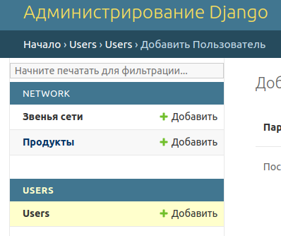
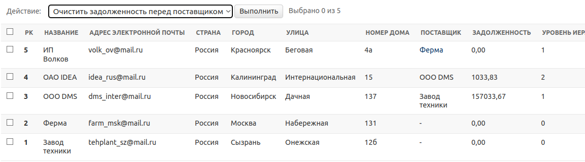
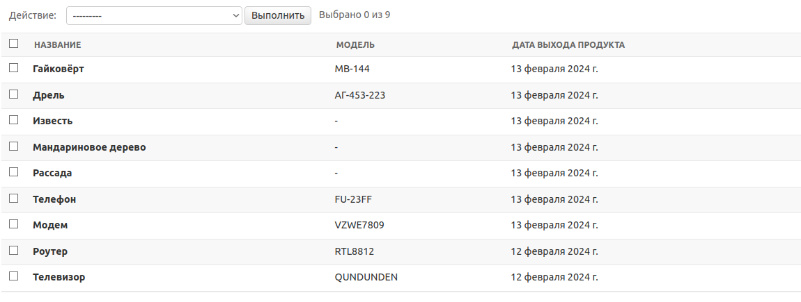

# **Electronic sales**

Это проект, написанный на языках 

- Python 3.11

С использованием библиотек/фреймворков:
- Django 5.0.1
- Django REST framework 3.14.0
- drf-spectacular 0.27.1
- PostgreSQL 16.2

Модель сети по продаже электроники, представленная с помощью веб-приложение, с API интерфейсом и админ-панелью. 

Сеть должна представлять собой иерархическую структуру из 3 уровней:
* Завод;
* Розничная сеть;
* Индивидуальный предприниматель. 

Каждое звено сети ссылается только на одного поставщика оборудования (не обязательно предыдущего по иерархии). 
Важно отметить, что уровень иерархии определяется не названием звена, а отношением к остальным элементам сети, 
т.е. завод всегда находится на 0 уровне, а если розничная сеть относится напрямую к заводу, минуя остальные 
звенья - её уровень - 1.


## **Установка**
### Для установки проекта Electronic sales, следуйте инструкциям ниже:

**<p>1. Сделайте Fork этого репозитория. Репозиторий появится в ваших личных репозиториях на GitHub.</p>**

**1.1 Сделайте `git clone` форкнутого репозитория, чтобы получить репозиторий локально:**

**<p>2. Перейдите в папку с проектом.</p>**

**<p>3. Создайте и активируйте виртуальное окружение:</p>**

`poetry init`

`poetry shell`

**<p>4. Установите зависимости проекта:</p>**

`poetry install`

**<p>5. Создайте файл .env в корневой папке проекта (electronic_sales/) и заполните данные для настройки проекта из файла .env.sample:</p>**

```ini
/.env/

# Django setting
DJANGO_SECRET_KEY=your django secret key

# PostgreSQL connection
DB_ENGINE=django.db.backends.engine
POSTGRES_DB=database name
POSTGRES_USER=postgresql username
POSTGRES_PASSWORD=postgresql password
POSTGRES_HOST=your host
POSTGRES_PORT=your port
```

**<p>6. Примените миграции:</p>**

`python manage.py migrate`

**<p>7. Воспользуйтесь командой для установки русского языка:</p>**

`django-admin compilemessages`

**<p>8. ЗАПУСК BACKEND-ЧАСТИ: Запустите сервер:</p>**

`python manage.py runserver` или настройте запуск Django сервера в настройках.


Таким образом можно работать с backend-частью локально для отладки.

После запуска сервера. Вы сможете перейти на сайт с документацией http://127.0.0.1:8000/api/docs/ 
(если сервер запущен локально), и начать пользоваться всеми API методами проекта. 

Также вы можете схему данных .yaml файлом по адресу http://127.0.0.1:8000/api/schema/ (если сервер запущен локально).

### Либо с помощью Docker
**<p>1. Создайте файл .env.docker в корневой папке проекта (electronic_sales/) и заполните данные для настройки проекта из файла .env.sample.docker:</p>**
```ini
/.env.docker/

# Django setting
DJANGO_SECRET_KEY=your django secret key

# PostgreSQL connection
DB_ENGINE=django.db.backends.engine
POSTGRES_DB=database name
POSTGRES_USER=postgresql username
POSTGRES_PASSWORD=postgresql password
POSTGRES_HOST=container name (default "db")
POSTGRES_PORT=your port
```

**<p>2. ЗАПУСК BACKEND-ЧАСТИ:: Воспользуйтесь командами:</p>**

`docker compose build` для создания оптимального билда проекта.

`docker compose up` для запуска docker compose контейнера.


## **Использование**
#### На проекте реализована регистрация новых пользователей через django админ-панель или API.
Также есть команда для создания суперпользователя `python manage.py csu` с данными из .env файла


#### Для тестирования вы можете заполнить базу данных данными из фикстур при помощи команды `python manage.py fixturedata`


Либо создать свои через django админ-панель или API. 
Для поля network модели NetworkLink используются выбор из 3 вариантов:
* plant
* retail_network
* individual_entrepreneur


Через django админ-панель можно очистить задолженность перед поставщиками или перейти на страницу поставщика. (через API
обновление задолженности запрещено)

Использовать API могут только активные пользователи (флаг is_active)

Автор
VictorVolkov7 - vektorn1212@gmail.com